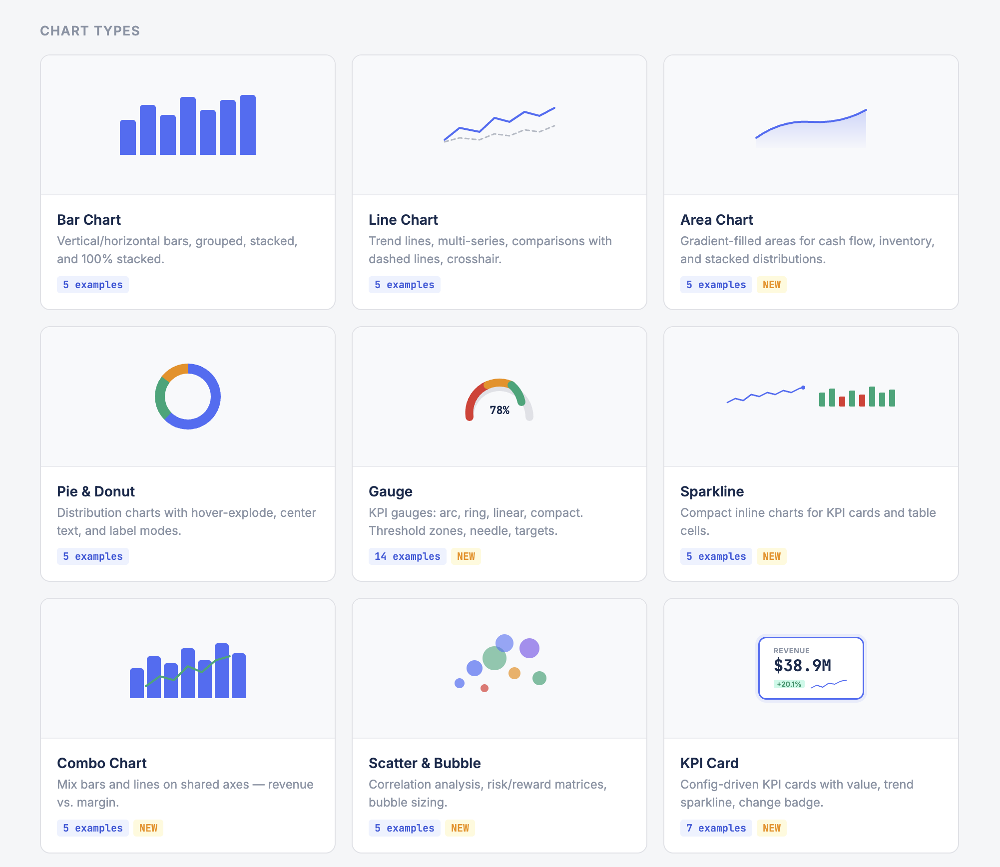

# NewChart JS

**A zero-dependency charting library for professional business applications.**

Modern SVG and Canvas rendering, smooth animations, dark mode, and a declarative API -- all in vanilla JavaScript with no external dependencies.

[Documentation](https://dalholm.github.io/newchartjs/) | [Live Demo](https://dalholm.github.io/newchartjs/demo)



---

## Features

- **Zero dependencies** -- pure vanilla JavaScript, no frameworks required
- **Dual rendering engine** -- SVG by default, automatic Canvas fallback at >5,000 data points
- **11 chart types** -- Bar, Line, Area, Pie/Donut, Gauge, Scatter/Bubble, Combo, Sparkline, NetworkBall, KPI Card, and TrendBadge
- **Animated** -- 13+ easing functions and spring physics via `requestAnimationFrame`
- **Responsive** -- adapts to any container size using `ResizeObserver`
- **Dark mode** -- built-in light, dark, and auto themes (follows `prefers-color-scheme`)
- **CSS custom properties** -- override colors, fonts, and spacing with `--nc-*` tokens
- **Interactive** -- tooltips, legends with toggle, hover effects, crosshair, and drill-down
- **Export** -- `toPNG()` and `toSVG()` for saving charts as images
- **Accessible** -- ARIA attributes on chart containers
- **Lightweight** -- small footprint with tree-shakeable ESM, CJS, and UMD builds

## Installation

### npm

```bash
npm install newchartjs
```

### CDN

```html
<script src="https://unpkg.com/newchartjs/dist/newchartjs.umd.js"></script>
```

## Quick Start

```javascript
import NewChart from 'newchartjs';

const chart = NewChart.create('#my-chart', {
  type: 'bar',
  data: {
    labels: ['Jan', 'Feb', 'Mar', 'Apr', 'May', 'Jun'],
    datasets: [{
      label: 'Revenue',
      values: [4200, 5800, 4900, 6100, 5500, 7200],
      color: '#4c6ef5'
    }]
  },
  options: {
    responsive: true,
    theme: 'auto'
  }
});

// Update data
chart.update({
  data: {
    datasets: [{ values: [5000, 6200, 5400, 6800, 6000, 7800] }]
  }
});

// Clean up
chart.destroy();
```

When using the UMD build via CDN, `NewChart` is available as a global:

```html
<div id="chart" style="width: 600px; height: 400px;"></div>
<script src="https://unpkg.com/newchartjs/dist/newchartjs.umd.js"></script>
<script>
  NewChart.create('#chart', {
    type: 'line',
    data: {
      labels: ['Q1', 'Q2', 'Q3', 'Q4'],
      datasets: [{ label: 'Growth', values: [12, 19, 14, 25] }]
    }
  });
</script>
```

## Chart Types

| Type | Description |
|------|-------------|
| **Bar** | Vertical and horizontal bars with grouped, stacked, and 100% stacked modes. Reference lines and budget markers. |
| **Line** | Trend lines with monotone cubic interpolation, multi-series, dashed comparisons, crosshair, and optional area fill. |
| **Area** | Gradient-filled area charts for cash flow, inventory, and cumulative data. Supports stacking. |
| **Pie / Donut** | Distribution charts with hover-explode, center text for donut variant, and multiple label modes. |
| **Gauge** | KPI gauges in four variants: arc, ring, linear, and compact. Threshold zones, needle, and target markers. |
| **Scatter / Bubble** | Correlation plots with optional bubble sizing for a third dimension. |
| **Combo** | Mix bars and lines on shared axes for revenue vs. margin, volume vs. price, and similar comparisons. |
| **Sparkline** | Compact inline charts (line, area, bar) designed for KPI cards and table cells. |
| **NetworkBall** | Animated 3D rotating node sphere with traveling cursors -- ideal for AI/processing visualizations. |
| **KPI Card** | Config-driven metric cards with value, trend sparkline, change badge, progress bar, and status indicator. |
| **TrendBadge** | Inline trend indicators with optional sparkline for tables, headers, and dashboards. |

## Theming

Set the theme in your chart config:

```javascript
NewChart.create('#chart', {
  type: 'bar',
  data: { /* ... */ },
  options: {
    theme: 'dark' // 'light', 'dark', or 'auto'
  }
});
```

Override styles with CSS custom properties:

```css
#chart {
  --nc-font-family: 'Inter', sans-serif;
  --nc-background: #1a1d23;
  --nc-font-color: #e0e2e7;
  --nc-grid-color: #2d3139;
}
```

## Development

```bash
# Install dependencies
npm install

# Start dev server with hot reload
npm run serve

# Build for production (Rollup)
npm run build

# Run tests (Vitest)
npm test

# Run tests in watch mode
npm run test:watch

# Test coverage
npm run test:coverage

# Start docs dev server (VitePress)
npm run docs:dev

# Build docs for deployment
npm run docs:build
```

## Browser Support

- Chrome / Edge (latest)
- Firefox (latest)
- Safari (latest)

Requires ES6+ and `ResizeObserver`.

## License

MIT -- Copyright (c) Nyehandel

See [LICENSE](./LICENSE) for details.
